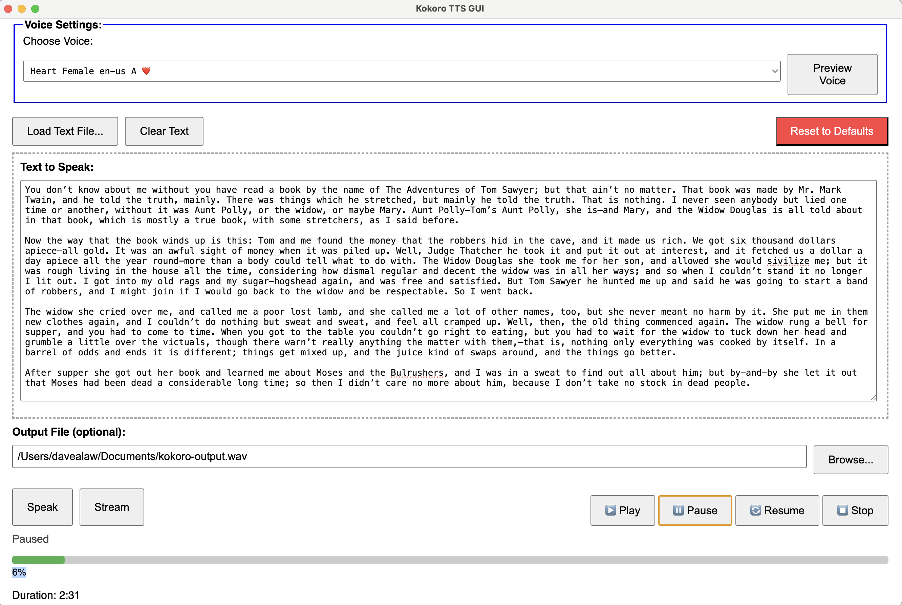

# Kokoro TTS GUI

A user-friendly Electron-based graphical interface for [kokoro-js](https://github.com/hexgrad/kokoro), a fast, local neural text-to-speech system. This application provides an intuitive way to convert text to speech using high-quality neural voices, all running locally on your machine.



_The intuitive interface featuring voice selection, text input with drag-and-drop support, built-in audio controls, and real-time progress tracking._

## ✨ Features

- 🎤 **Multiple neural voice models** via [kokoro-js](https://github.com/hexgrad/kokoro)
- ⚡ **Fast, local processing** – no internet required after initial model download
- 🎵 **High-quality audio output** in WAV format
- 👂 **Real-time voice preview** – hear samples before synthesis
- 📝 **Large text area** for manual input with word count
- 📁 **File loading support** (.txt, .md, .html, .js, .json, and more)
- 🎯 **Drag-and-drop file support** – just drop files onto the text area
- 💻 **Clean, intuitive GUI** built with Electron
- 💾 **Persistent settings** – remembers your preferences between sessions
- 🎮 **Built-in audio player** with play/pause/stop/resume controls
- 📂 **Custom output file selection** – save anywhere you want
- 📊 **Progress tracking** for long text processing with duration estimates
- 🌊 **Streaming synthesis** for large texts with real-time audio chunks
- ⏹️ **Cancel support** – stop synthesis or streaming at any time
- 🔄 **Reset to defaults** – quickly restore original settings
- ⌨️ **Keyboard shortcuts** for power users
- 🎨 **Modular ES6 architecture** for maintainability

## 🚀 Installation

### Prerequisites

- **Node.js** (version 18 or higher recommended)
- **npm** (comes with Node.js)

### Quick Start

1. **Clone the repository:**

   ```bash
   git clone https://github.com/davealaw/kokoro-electron.git
   cd kokoro-electron
   ```

2. **Install dependencies:**

   ```bash
   npm install
   ```

3. **Run the application:**
   ```bash
   npm start
   ```

### First Launch

On first launch, the app will automatically download the TTS model (~80MB) to your system cache directory:

- **macOS/Linux:** `~/.cache/kokoro-electron/`
- **Windows:** `%LOCALAPPDATA%\kokoro-electron\`

This ensures models are persistent across app updates and can be shared between development and packaged versions.

## 📚 Usage

### Basic Workflow

1. **🎤 Select a Voice:** Choose from available neural voice models in the dropdown
2. **👂 Preview Voice:** Click "Preview Voice" to hear a sample before synthesis
3. **📝 Enter Text:** Type/paste text or load from a file
4. **🎵 Generate Speech:**
   - **"Speak"** - Process entire text at once (good for shorter texts)
   - **"Stream"** - Real-time streaming synthesis (better for longer texts)
5. **🎵 Play Audio:** Use built-in player controls to play the generated audio

### Text Input Options

#### Manual Input

- Type or paste text directly into the text area
- Word count is displayed in real-time
- Text is auto-saved between sessions

#### File Loading

- **Click "Load Text File"** to browse and select a file
- **Drag and drop** supported files directly onto the text area
- **Supported formats:** .txt, .md, .html, .js, .json, .xml, .csv, .log, and more
- Files are validated for text content and size limits

### Audio Output

#### Default Behavior

- Audio is saved as `kokoro-output.wav` in your Documents folder
- Previous settings are remembered across sessions

#### Custom Output

- Click **"Browse..."** to choose a custom location and filename
- Supports any .wav filename and location
- Path is validated and remembered for future use

### Synthesis Modes

#### Standard Synthesis ("Speak")

- Processes the entire text at once
- Shows progress bar with completion percentage
- Best for shorter texts (< 1000 words)
- Includes duration estimates

#### Streaming Synthesis ("Stream")

- Real-time chunk-by-chunk processing
- Audio plays as it's generated
- Ideal for longer texts or immediate feedback
- Can be canceled mid-stream
- Uses parallel processing for efficiency

## 🎤 Voice Models

Kokoro TTS GUI uses high-quality neural voice models from [onnx-community/Kokoro-82M-ONNX](https://huggingface.co/onnx-community/Kokoro-82M-ONNX).

### Model Details

- **Size:** ~80MB compressed model
- **Quality:** High-fidelity neural synthesis
- **Languages:** English (primary)
- **Voices:** Multiple speakers with different characteristics (gender, accent, tone)
- **Format:** ONNX optimized for cross-platform inference
- **Local Processing:** No internet required after download

### Voice Selection

- Browse available voices in the dropdown menu
- Each voice shows: Name, Gender, Language, Grade, and Traits
- Use "Preview Voice" to hear samples before selecting
- Last selected voice is remembered between sessions

## ⌨️ Keyboard Shortcuts

- **Ctrl/Cmd + L**: Load text file
- **Ctrl/Cmd + Enter**: Start speech synthesis ("Speak" button)
- **Escape**: Cancel current synthesis or streaming
- **Ctrl/Cmd + R**: Reset to defaults
- **Space**: Play/pause audio (when audio player is focused)

## ⚙️ Configuration

### Settings Storage

- Settings are automatically saved using [electron-store](https://github.com/sindresorhus/electron-store)
- **Location:** OS-specific application data directory
  - **macOS:** `~/Library/Application Support/kokoro-electron/config.json`
  - **Windows:** `%APPDATA%\kokoro-electron\config.json`
  - **Linux:** `~/.config/kokoro-electron/config.json`

### Persistent Settings

- Last selected voice model
- Text content (auto-saved)
- Output file path
- Window position and size
- Audio player state

### Cache Directory

- TTS models are cached separately from settings
- **Location:** `~/.cache/kokoro-electron/` (macOS/Linux) or `%LOCALAPPDATA%\kokoro-electron\` (Windows)
- Models persist across app updates
- Can be safely deleted to force re-download

## 🔧 Troubleshooting

### Common Issues

#### "No voices found" or "Model failed to load"

- **Cause:** TTS model download failed or is corrupted
- **Solution:**
  1. Delete cache directory (see Configuration section)
  2. Restart app to trigger fresh model download
  3. Ensure stable internet connection for initial download
  4. Check system has ~200MB free space

#### "Audio doesn't play"

- **Cause:** Output file issues or system audio problems
- **Solutions:**
  1. Check output file location exists and is writable
  2. Verify system audio settings and volume
  3. Try different output location (e.g., Desktop)
  4. Ensure WAV format is supported by your system

#### "App crashes or fails to synthesize"

- **Cause:** Various system or input issues
- **Solutions:**
  1. Check console for detailed error messages (in development: `npm start`)
  2. Try shorter text input to isolate the issue
  3. Restart the application
  4. Clear cache and settings using "Reset to Defaults"
  5. Check system requirements (Node.js version, available memory)

#### "Slow performance"

- **Optimization tips:**
  1. Use "Stream" mode for longer texts
  2. Ensure adequate system memory (4GB+ recommended)
  3. Close other resource-intensive applications
  4. For very long texts, consider splitting into smaller chunks

### Getting Help

- **Check logs:** Run `npm start` to see detailed console output
- **Reset settings:** Use "Reset to Defaults" button to restore original configuration
- **Report issues:** [GitHub Issues](https://github.com/davealaw/kokoro-electron/issues)
- **System requirements:** Node.js 18+, 2GB RAM minimum, 500MB disk space

## 💻 Development

### Project Structure

```
kokoro-electron/
├── main.js                    # Main Electron process & IPC handlers
├── preload.js                 # Secure IPC bridge
├── index.html                 # Main UI layout
├── package.json               # Dependencies, scripts & build config
├── scripts/                   # Modular frontend JavaScript (ES6)
│   ├── dom.js                 # Main DOM controller & event handlers
│   ├── tss.js                 # TTS orchestration & UI updates
│   ├── audio.js               # Audio player controls
│   ├── settings.js            # Voice loading & settings UI
│   ├── states.js              # UI state management
│   ├── dragdrop.js            # File drag-and-drop handling
│   ├── utils.js               # Utility functions
│   ├── debug.js               # Development debugging tools
│   ├── file-utils.js          # File validation & processing
│   ├── text-utils.js          # Text chunking & processing
│   ├── audio-utils.js         # WAV buffer operations
│   ├── tts-manager.js         # TTS engine management
│   └── settings-manager.js    # Settings persistence
├── styles/
│   └── main.css               # Application styling
├── assets/                    # Icons for distribution builds
├── tests/                     # Comprehensive test suite
│   ├── unit/                  # Unit tests for modules
│   ├── integration/           # Integration tests
│   └── setup.js               # Test configuration & mocks
├── babel.config.js            # Babel configuration for tests
├── jest.config.js             # Jest test runner configuration
├── eslint.config.js           # ESLint code quality rules
└── .prettierrc                # Prettier code formatting
```

### Development Setup

```bash
# Clone and install
git clone https://github.com/davealaw/kokoro-electron.git
cd kokoro-electron
npm install

# Development
npm start                      # Run in development mode
npm run test                   # Run test suite
npm run test:watch             # Run tests in watch mode
npm run test:coverage          # Generate coverage report
npm run lint                   # Check code quality
npm run format                 # Format code with Prettier
npm run code-quality           # Run both linting and formatting checks
```

### Building for Distribution

```bash
# Build for current platform
npm run build

# Platform-specific builds
npm run build:mac              # macOS (DMG + ZIP)
npm run build:win              # Windows (NSIS installer + ZIP)
npm run build:linux            # Linux (AppImage + DEB)

# Test build without packaging
npm run pack                   # Creates dist/ with unpackaged app
```

### Architecture Overview

#### Electron Structure

- **Main Process** (`main.js`): Node.js backend handling file I/O, TTS integration, settings
- **Renderer Process** (`index.html` + `scripts/`): Web-based frontend with modular ES6 architecture
- **Preload Script** (`preload.js`): Secure IPC bridge between main and renderer

#### Key Design Patterns

- **Modular ES6**: Each script handles a specific domain (audio, settings, drag-drop, etc.)
- **Event-Driven**: DOM events drive state changes and TTS operations
- **Persistent State**: Settings auto-save using electron-store
- **Progress Tracking**: Real-time feedback for long operations
- **Error Handling**: Comprehensive error recovery and user feedback

#### TTS Integration

- **Engine**: [kokoro-js](https://github.com/hexgrad/kokoro) for neural synthesis
- **Modes**: Standard (batch) and streaming (real-time) synthesis
- **Caching**: External cache directory for model persistence
- **Optimization**: Concurrent processing with p-limit for performance

### Testing

- **Unit Tests**: 258+ tests covering core modules
- **Coverage**: 64%+ code coverage
- **Integration Tests**: End-to-end functionality testing
- **Mocking**: Comprehensive Electron API and DOM mocking
- **CI Ready**: All tests pass consistently

### Code Quality

- **ESLint**: Modern ES6+ linting with Jest plugin
- **Prettier**: Consistent code formatting
- **Husky**: Pre-commit hooks for quality assurance
- **Lint-staged**: Only lint/format changed files

## 🤝 Contributing

Contributions are welcome! This project follows modern development practices with comprehensive testing and code quality tools.

### Development Process

1. **Fork and clone** the repository
2. **Create a feature branch:** `git checkout -b feature/amazing-feature`
3. **Install dependencies:** `npm install`
4. **Make your changes** with proper testing
5. **Run quality checks:**
   ```bash
   npm run test              # Ensure all tests pass
   npm run code-quality      # Check linting and formatting
   npm run test:coverage     # Verify coverage standards
   ```
6. **Commit with clear messages:** `git commit -m 'Add amazing feature'`
7. **Push to branch:** `git push origin feature/amazing-feature`
8. **Submit a Pull Request** with detailed description

### Code Standards

- **ES6+ modules** for frontend JavaScript
- **Comprehensive testing** for new features
- **ESLint + Prettier** for code quality
- **Clear documentation** for public APIs
- **Semantic commit messages**

### Areas for Contribution

- 🎤 Additional voice model support
- 🌍 Internationalization (i18n)
- 🎨 UI/UX improvements
- ⚡ Performance optimizations
- 📱 Accessibility enhancements
- 🔍 Additional file format support
- 📊 Analytics and usage insights

## 📜 License

This project is licensed under the **MIT License** - see the [LICENSE](LICENSE) file for details.

### What this means:

- ✅ Commercial use
- ✅ Modification
- ✅ Distribution
- ✅ Private use
- ❌ No warranty
- ❌ No liability

## 🙏 Acknowledgments

### Core Technologies

- **[kokoro-js](https://github.com/hexgrad/kokoro)** - The underlying neural text-to-speech engine
- **[Electron](https://www.electronjs.org/)** - Cross-platform desktop framework
- **[onnx-community/Kokoro-82M-ONNX](https://huggingface.co/onnx-community/Kokoro-82M-ONNX)** - High-quality TTS models

### Development Tools

- **[electron-builder](https://www.electron.build/)** - Application packaging and distribution
- **[electron-store](https://github.com/sindresorhus/electron-store)** - Settings persistence
- **[Jest](https://jestjs.io/)** - Testing framework
- **[ESLint](https://eslint.org/) + [Prettier](https://prettier.io/)** - Code quality and formatting
- **[Husky](https://typicode.github.io/husky/)** - Git hooks for quality assurance

### Community

- Thanks to all contributors and users providing feedback
- Special thanks to the Kokoro TTS research team for the neural models
- Electron community for comprehensive documentation and examples

---

## 📦 System Requirements

- **Node.js:** 18.0.0 or higher
- **npm:** 9.0.0 or higher (comes with Node.js)
- **RAM:** 2GB minimum, 4GB recommended
- **Storage:** 500MB free space (including cache)
- **OS:** macOS 10.14+, Windows 10+, or modern Linux distribution

---

**ℹ️ Note:** This application runs entirely locally after the initial model download. No external TTS services or API keys are required.
